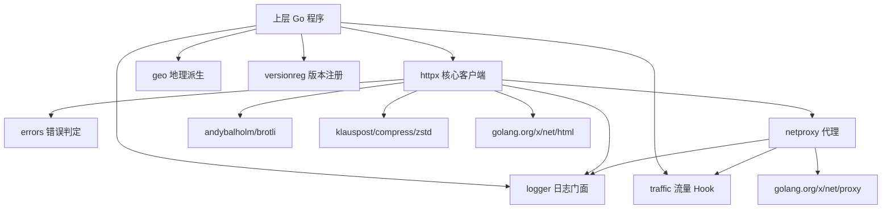
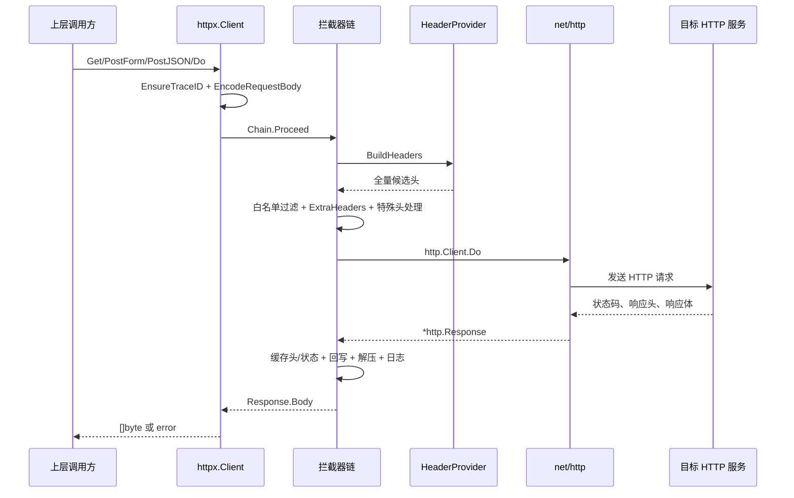
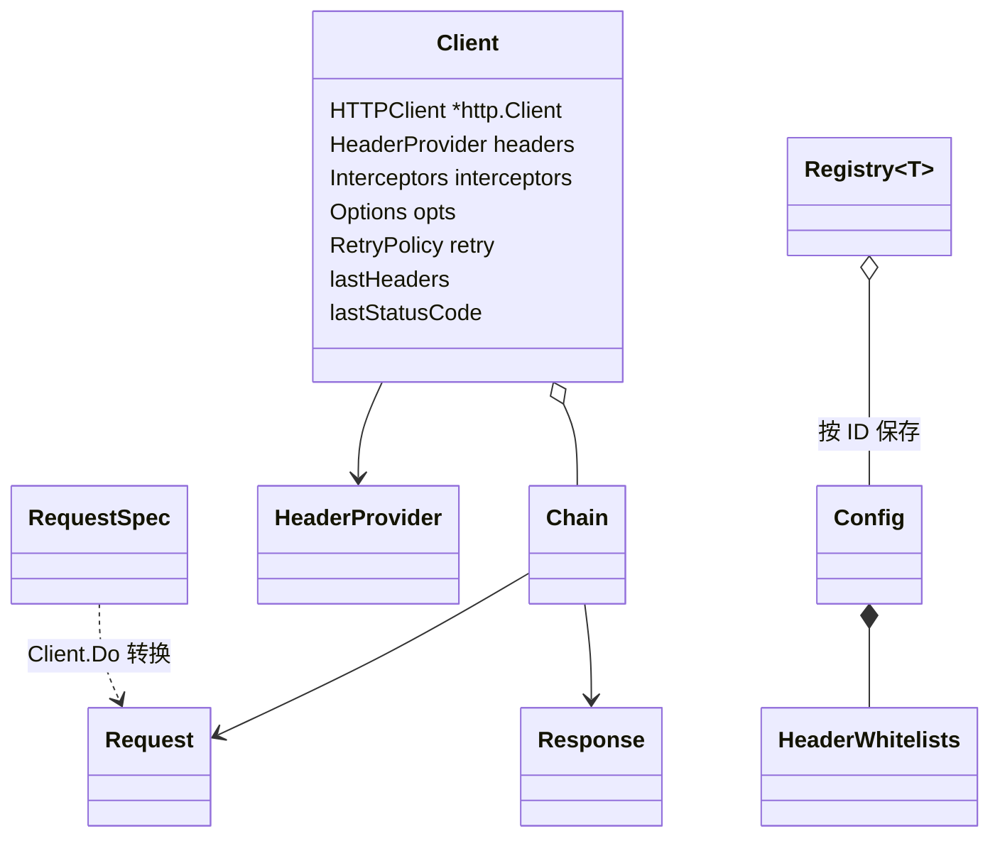

# gohttpkit 项目架构

> 本文依据当前仓库代码整理，描述的是 `gohttpkit` 自身，不包含接入它的上层业务系统。

## 1. 这个项目是干什么的

`gohttpkit` 是一个可复用的 Go HTTP 客户端基础库，不是一个可独立部署的前后端业务系统。

它主要解决下面几类问题：

- 用类似 OkHttp 的拦截器链组织一次 HTTP 请求；
- 对网络发送失败做自动重试和指数退避；
- 解压 `zstd`、`gzip`、`deflate`、`br` 四种响应体；
- 精确控制请求头、头名大小写和白名单，便于高保真复刻真实客户端请求；
- 接入 SOCKS5、HTTP、HTTPS 代理；
- 记录结构化日志、`trace_id`、轻量 span 和完整请求/响应快照；
- 提供网络错误、地理语言/时区、TCP 流量统计、协议版本注册等通用能力。

项目刻意不包含具体业务 API、账号规则、业务错误码和数据库逻辑。调用方通过 `HeaderProvider`、自定义拦截器、回调函数和版本配置接入自己的业务。

## 2. 项目边界

当前仓库中不存在以下部分：

- 前端页面或前端框架；
- 对外提供 HTTP 服务的路由、Controller 或 Handler；
- 数据库驱动、ORM、数据表、迁移脚本和持久化仓储层；
- 固定绑定的业务服务地址或业务接口清单。

因此，本项目没有“前端 → 后端 → 数据库”的数据链。真实的数据主链是：

```text
上层 Go 程序 → gohttpkit 客户端 → 目标 HTTP 服务
             ← 响应处理与状态回写 ←
```

## 3. 项目目录结构

```text
gohttpkit/
├── httpx/                 # 核心 HTTP 客户端、拦截器链、重试、解压、请求头和 Transport
├── logger/                # 基于 slog 的全局日志门面、trace_id、span
├── errors/                # 可重试网络错误与 HTTP 状态错误
├── netproxy/              # SOCKS5 / HTTP / HTTPS 代理配置与代理拨号
├── traffic/               # net.Conn 层的真实收发字节统计
├── geo/                   # 国家、locale、Accept-Language、时区与代理国家解析
├── versionreg/            # 泛型版本注册表、端点白名单和示例版本配置
├── examples/
│   ├── quickstart/        # 最小客户端示例
│   ├── customchain/       # 自定义签名、计数、状态回写、业务归类示例
│   └── fidelity/          # 请求高保真复刻与完整快照示例
├── docs/                  # 迁移说明、代码规范和本文档
├── .github/workflows/     # CI：构建、vet、测试、覆盖率、race、示例和 lint
├── Makefile               # 本地与 CI 质量门禁入口
└── go.mod                 # 模块声明和三个直接外部依赖
```

测试与源码放在同一包目录，测试文件与源文件同名。`httpx/characterization_test.go` 重点锁定对外行为，各源文件同名的 `*_test.go`（如 `httpx/options_test.go`、`httpx/presets_test.go`、`httpx/interceptor/*_test.go`）覆盖单个 API 契约，`httpx/concurrency_test.go` 负责并发回归。用例观察日志用 `t.Logf`，`go test -v` 才输出，规范见 `docs/CODE_STANDARDS.md` 第 8.1 节。

## 4. 总体分层与依赖关系



仓库内部没有循环依赖。关键依赖关系来自以下真实文件：

- `httpx/options.go`、`httpx/interceptor` → `errors`；
- `httpx/client.go`、`httpx/interceptor` → `logger`；
- `httpx/transport.go` → `netproxy`；
- `netproxy/proxy.go` → `logger`、`traffic`；
- `geo`、`versionreg` 不依赖 `httpx`，由上层按需组合。

## 5. 核心模块及职责

| 模块 | 主要职责 | 关键文件 |
|---|---|---|
| `httpx` | 创建客户端、编码请求、执行拦截器链、精确发头 | `httpx/client.go`、`httpx/presets.go`、`httpx/chain.go` |
| `httpx/interceptor` | 默认链、重试、解压、缓存、日志与可选业务层 | `httpx/interceptor/` |
| `logger` | 统一结构化日志；从 `context.Context` 自动注入 `trace_id`、`span_id` 和公共字段 | `logger/logger.go`、`logger/context.go`、`logger/span.go` |
| `errors` | 判断瞬时网络错误，包装重试耗尽错误和 HTTP 状态错误 | `errors/errors.go` |
| `netproxy` | 校验代理 URL，把 SOCKS5 或 HTTP(S) 代理接到 `http.Transport` | `netproxy/proxy.go` |
| `traffic` | 在 `net.Conn.Read/Write` 层按增量统计字节，由调用方注入全局 Hook | `traffic/traffic.go` |
| `geo` | 国家码查 locale / 时区，按 Chromium 规则拼 Accept-Language | `geo/locale_web.go`、`geo/locale_mobile.go`、`geo/lookup.go`、`geo/timezone.go`、`geo/timezone_iana.go`、`geo/errors.go` |
| `versionreg` | 隔离不同协议版本，按版本注册配置，并按端点保存头白名单和接口标识 | `versionreg/registry.go`、`versionreg/endpoints.go` |

### 5.1 `httpx` 的核心设计

`httpx` 是整个项目的主干。默认拦截器链的顺序定义在 `httpx/interceptor/chain.go` 的 `DefaultChain`：

```text
请求方向（外 → 内）

logging
  → bodyDecode
    → statusCodeCache
      → responseHeaderCache
        → retry
          → bridge
            → callServer

响应方向与上面相反。
```

各层的作用：

- `logging`：记录最终请求结果和总耗时；
- `bodyDecode`：读取、关闭并按 `content-encoding` 解压响应体；
- `statusCodeCache`：保存最近一次响应状态码；
- `responseHeaderCache`：保存响应头并执行 `Options.OnResponseHeaders`；
- `retry`：只重试网络发送错误，不默认重试 HTTP 状态码；
- `bridge`：每次尝试重新构建 `http.Request`、请求体和请求头；
- `callServer`：唯一真正调用 `http.Client.Do` 的终端层。

默认链不做业务错误归类，也不会把所有非 2xx 响应自动变成错误。调用方需要时可显式添加 `interceptor.NewClassifyInterceptor`、`interceptor.NewStatusSemanticsInterceptor` 或 `interceptor.NewHTMLTextInterceptor`。

## 6. 最重要的业务调用链

这里的“业务”指本库真正负责的 HTTP 基础能力，不是某个上层产品的业务。

### 6.1 客户端创建链

```text
interceptor.NewClient             httpx/interceptor/client.go
├── Interceptors 为 nil 时填 DefaultChain
└── httpx.New                     httpx/client.go
    ├── 校验 Options.Headers
    ├── 未传 Transport 时：
    │   └── newTransport（内部）  httpx/transport.go
    │       └── netproxy.ApplyProxyToTransport
    │                              netproxy/proxy.go
    ├── 固化 Timeout / SlowMS     httpx/options.go
    └── 归一化 RetryPolicy        httpx/options.go
```

这一步只创建客户端和网络配置，不会向目标服务发请求。

### 6.2 一次普通 HTTP 请求链



真实文件路径如下：

1. `Client.Get`、`PostForm`、`PostJSON` 最终都进入 `Client.Do`：`httpx/client.go`。
2. `Client.Do` 注入 `trace_id`、拼 URL、调用 `EncodeRequestBody` 并创建 `Chain`：`httpx/client.go`、`httpx/body.go`。
3. `Chain.Proceed` 按顺序推进拦截器：`httpx/chain.go`。
4. 默认链的顺序由 `DefaultChain` 固定：`httpx/interceptor/chain.go`。
5. `bridgeInterceptor` 每次尝试都调用 `HeaderProvider.BuildHeaders`，再处理白名单、额外头和标准库特殊头：`httpx/interceptor`、`httpx/headers.go`。
6. `callServerInterceptor` 调用 `http.Client.Do`：`httpx/interceptor`。
7. 响应返回后先缓存响应头并执行状态回写，再缓存状态码、读取和解压响应体、记录日志：`httpx/interceptor`。

### 6.3 网络失败与重试链

```text
http.Client.Do 返回错误                         httpx/interceptor
  → callServer 包装成 *httpx.TransportError     httpx/interceptor/do_http.go
  → retryInterceptor 用 errors.As 识别
  → RetryPolicy.IsRetryable 判断                httpx/options.go
      └── 默认调用 IsRetryableNetworkError      errors/errors.go
  → 可重试：等待指数退避后重新执行 bridge + callServer
  → 重试耗尽：返回 *errors.RetryableError        errors/errors.go
```

重要边界：

- HTTP 4xx/5xx 本身不会触发默认重试；
- 创建请求、构建请求头等配置错误不会重试；
- 每次重试都会重新构建请求体和请求头；
- 响应体读取或解压发生在重试层外，因此读体阶段的瞬时网络错误会包装成 `RetryableError` 交给调用方，但不会在本次调用内自动重试。

### 6.4 会话状态回写链

```text
HeaderProvider.BuildHeaders                    httpx/headers.go
  → bridge 发出当前 cookie/token               httpx/interceptor
  → 服务端返回新响应头
  → responseHeaderCacheInterceptor             httpx/interceptor
      ├── 更新 Client 最近响应头快照
      └── 调用 Options.OnResponseHeaders       httpx/options.go
          └── 上层更新自己的 HeaderProvider
              └── 下一次请求带上新状态
```

`examples/customchain/main.go` 展示 token 回写，`examples/fidelity/main.go` 展示 `Set-Cookie` 回写。`HeaderProvider` 的可变状态和并发安全由调用方负责。

### 6.5 代理与流量统计链

```text
Options.ProxyURL                              httpx/options.go
  → NewTransport                             httpx/transport.go
  → ApplyProxyToTransport                    netproxy/proxy.go
      ├── socks5：改写 Transport.DialContext
      │   → x/net/proxy.DialContext
      │   → traffic.WrapConn                 traffic/traffic.go
      │   → Read/Write 增量上报全局 Hook
      └── http/https：设置 Transport.Proxy
```

当前代码只有 SOCKS5 拨号路径会进入 `traffic.WrapConn`。HTTP/HTTPS 代理使用标准库 `Transport.Proxy`，不会经过这条流量 Hook；直连也不会自动计入 `traffic`。

### 6.6 地理信息派生链

四条查表互相独立，都经 `lookup.go` 归一化国家码；未命中是 `*UnknownCountryError`（IANA 子集用 bool，不报错）。

```text
国家码
  → WebAcceptLanguageForCountry     Chrome data-code           locale_web.go
  → MobileLocaleForCountry          Android 下划线 locale      locale_mobile.go
  → TimezoneOffsetForCountry        冬令时偏移秒（0 合法）     timezone.go
  → IANATimezoneForCountry          IANA 名（未收录 → false）  timezone_iana.go

Android（Meta 系 App）locale header 子包 geo/locale_mobile（package localemobile），
一个 header 一个文件，keyset 与上面三表对齐：
  → AcceptLanguageForCountry        zh-CN, en-US               accept_language.go
  → AppLocaleForCountry             zh_CN_#Hans                app_locale.go
  → DeviceLocaleForCountry          zh_CN_#Hans                device_locale.go
  → MappedLocaleForCountry          zh_CN                      mapped_locale.go
  → DeviceLanguagesForCountry       {"system_languages":…}     device_languages.go

Accept-Language 两条入口，调用方只走其中一条：
  → BuildChromeAcceptLanguage(tags)                      已排好序的 data-code
  → BuildChromeAcceptLanguageForCountry(cc, extra, rng)  内部抽样后再拼，不必再调上一行
      extra<0 → *InvalidExtraLanguageCountError
      extra 超出候选 → *ExtraLanguageCountExceedsPoolError
```

查表函数不偷偷改成 Accept-Language。语言列表优先级由调用方组合。

### 6.7 版本配置链

```text
上层版本包 init
  → Registry.MustRegister                    versionreg/registry.go
      → Config.Validate                      versionreg/example_config.go
      → 以 versionreg.ID 写入内存 map

运行时
  → Registry.Get / MustGet                   versionreg/registry.go
  → Config.HeaderWhitelist / DocID / Param   versionreg/example_config.go
  → 上层把白名单传给 httpx.RequestSpec       httpx/client.go
```

`versionreg` 与 `httpx` 没有代码级直接依赖，二者由上层业务组合。

## 7. 数据流向

### 7.1 请求与响应数据

```mermaid
flowchart LR
    A[上层业务参数] --> B[RequestSpec]
    B --> C[EncodeRequestBody]
    H[HeaderProvider] --> D[bridge 构建请求头]
    V[HeaderWhitelist] --> D
    C --> E[http.Request]
    D --> E
    E --> F[Transport / 可选代理]
    F --> G[外部 HTTP 服务]
    G --> R[http.Response]
    R --> S[响应头缓存与状态回写]
    S --> Z[响应体解压]
    Z --> O[可选业务归类/HTML 提纯]
    O --> P[返回 []byte / error]
    O -.可选.-> T[Transaction 或 HTML sink]
    O -.默认.-> L[结构化日志]
```

关键数据对象的变化：

1. 上层传入 `RequestSpec`，其中包含方法、路径、查询参数、请求体、额外请求头和白名单，定义在 `httpx/client.go`。
2. `Client.Do` 把它转换为链内可修改的 `Request`，定义在 `httpx/chain.go`。
3. `bridgeInterceptor` 再把 `Request` 转换为标准库 `http.Request`，定义在 `httpx/interceptor`。
4. 终端层把标准库 `http.Response` 转换为链内 `Response`，定义在 `httpx/chain.go`、`httpx/interceptor`。
5. `bodyDecodeInterceptor` 读完并关闭原始响应体，把最终字节写入 `Response.Body`。
6. `Client.Do` 最终只把 `Response.Body` 返回给上层；状态码和响应头通过并发安全的快照方法读取。

### 7.2 持久化边界

本库没有数据库写入。可能发生的本地输出只有：

- `logger` 根据配置把日志写到标准输出或文件：`logger/logger.go`；
- `interceptor.NewTransactionInterceptor`、`interceptor.NewHTMLSaveInterceptor` 只把数据交给调用方提供的 sink：`httpx/interceptor`；
- `examples/fidelity/main.go` 演示由示例代码把 `Transaction` 写成 JSON 文件，这不是库的默认行为。

## 8. 数据库核心模型及关系

当前项目没有数据库，所以不存在数据库核心模型或表关系。

为了理解运行时数据，可以把主要内存对象看成下面的关系：



这些对象只存在于进程内：

- `Client` 持有传输层、请求头提供者、拦截器链和最近一次响应快照；
- `RequestSpec` 是公开请求入参，`Request` 和 `Response` 是链上的运行时状态；
- `Registry[T]` 用带锁的内存 map 保存版本配置，不会落库；
- `Config` 聚合版本参数、端点白名单和 `docID`。

## 9. 核心 API

本项目没有服务端 REST API。这里的“核心 API”是提供给其他 Go 项目调用的公开 Go API。

### 9.1 客户端与请求

| API | 用途 | 文件 |
|---|---|---|
| `httpx.New(Options)` | 创建客户端，不装默认链 | `httpx/client.go` |
| `interceptor.NewClient(Options)` | 创建客户端，nil 链时填 DefaultChain | `httpx/interceptor/client.go` |
| `Client.Do(ctx, RequestSpec)` | 完整请求入口 | `httpx/client.go` |
| `Client.Get` / `PostForm` / `PostJSON` | 常用请求快捷方法 | `httpx/client.go` |
| `HeaderProvider` | 由上层提供基础 URL 和候选请求头 | `httpx/headers.go` |
| `StaticHeaders` / `HeaderProviderFunc` | 两种简单的 `HeaderProvider` 实现 | `httpx/headers.go` |
| `SnapshotResponseStatusCode` / `SnapshotResponseHeaders` | 并发安全读取最近响应状态 | `httpx/client.go` |
| `WithChain` | 共享会话和 Transport，派生不同拦截器链 | `httpx/client.go` |

### 9.2 拦截器链

| API | 用途 | 文件 |
|---|---|---|
| `interceptor.DefaultChain` / `NoRedirectChain` / `APIChain` | 三种预设链 | `httpx/interceptor/chain.go` |
| `httpx.Prepend` / `SpliceBeforeTerminal` | 在最外层或每次真实发送前插入拦截器 | `httpx/presets.go` |
| `httpx.InsertBefore` / `InsertAfter` / `Replace` / `Without` | 编辑链 | `httpx/presets.go` |
| `interceptor.NewClassifyInterceptor` | 把业务响应归类为 error | `httpx/interceptor/classify.go` |
| `interceptor.NewStatusSemanticsInterceptor` | 定义非 2xx 的处理规则 | `httpx/interceptor/status_semantics.go` |
| `interceptor.NewRequestMutatorInterceptor` | 在发送前删头、签名或改写请求 | `httpx/interceptor/request_mutator.go` |
| `interceptor.NewTransactionInterceptor` / `NewHTMLSaveInterceptor` | 把观察数据交给调用方 sink | `httpx/interceptor/{transaction,html_save}.go` |

### 9.3 支撑能力

| API | 用途 | 文件 |
|---|---|---|
| `netproxy.ApplyProxyToTransport` / `ParseProxyURL` | 配置代理或取得 SOCKS5 Dialer | `netproxy/proxy.go` |
| `traffic.SetHook` / `WrapConn` | 注入字节统计回调、包装连接 | `traffic/traffic.go` |
| `geo.WebAcceptLanguageForCountry` / `BuildChromeAcceptLanguage*` / `MobileLocaleForCountry` / `TimezoneOffsetForCountry` / `IANATimezoneForCountry` | 查 Chrome 码或 Android locale、按 Chromium 拼 Accept-Language、派生时区 | `geo/locale_web.go`、`geo/locale_mobile.go`、`geo/timezone.go`、`geo/timezone_iana.go` |
| `localemobile.AcceptLanguageForCountry` / `AppLocaleForCountry` / `DeviceLocaleForCountry` / `MappedLocaleForCountry` / `DeviceLanguagesForCountry` | 按国家查 Android 端五个 locale header 的值 | `geo/locale_mobile/*.go` |
| `versionreg.New` / `Registry.MustRegister` / `Registry.Get` | 创建并访问版本注册表 | `versionreg/registry.go` |
| `logger.WithTraceID` / `StartSpan` / `Info` 等 | 关联和输出结构化日志 | `logger/context.go`、`logger/span.go`、`logger/logger.go` |

## 10. 第三方服务与外部依赖

### 10.1 第三方服务

生产代码没有绑定固定第三方服务：

- 目标 HTTP 服务由 `HeaderProvider.BaseURL()` 或 `RequestSpec.Path` 的绝对 URL 决定；
- 代理服务由调用方通过 `Options.ProxyURL` 传入；
- `examples/quickstart/main.go` 默认请求 `https://httpbin.org/get`，这只是可替换的演示地址；
- 另外两个示例和绝大多数网络测试使用本地 `httptest` 假服务，不依赖外网。

### 10.2 Go 第三方库

直接依赖以 `go.mod` 为准，并保持各模块最新稳定版（用 IDE「更新直接依赖项 / 更新所有依赖项」或 `go get -u` 升级，不在这里钉死版本号）：

| 依赖 | 用途 |
|---|---|
| `github.com/andybalholm/brotli` | 解压 Brotli 响应体 |
| `github.com/klauspost/compress` | 解压 Zstandard 响应体 |
| `golang.org/x/net` | HTML 解析和 SOCKS5 代理 |

HTTP、TLS、日志、并发和基础压缩能力主要使用 Go 标准库。

## 11. 最应该先看的 5 个文件

建议按下面顺序阅读：

1. `README.md`：先理解项目目标、边界、默认行为和主要使用方式。
2. `httpx/client.go`：看公开入口、`Client` 状态以及 `RequestSpec` 如何进入执行链。
3. `httpx/interceptor/chain.go`：看默认拦截器顺序；链顺序就是这个库最重要的运行语义。
4. `httpx/interceptor/`：看重试、请求构建、真正出网和响应解压的完整实现。
5. `httpx/headers.go`：看 `HeaderProvider`、白名单和精确发头规则，这是接入业务的关键接缝。

读完这 5 个文件后，再根据需要看：配置项读 `httpx/options.go`，日志读 `logger/`，代理读 `netproxy/proxy.go`，地理派生读 `geo/`，多协议版本读 `versionreg/`。

## 12. 架构上的重要约束

- `HeaderWhitelist == nil` 表示发送全部候选头，空 map 表示一个头都不发；见 `httpx/headers.go`、`httpx/interceptor`。
- 默认链不会因为非 2xx 自动报错，也不会自动解释业务响应；见 `httpx/interceptor/chain.go`。
- 只有 `TransportError` 会进入默认自动重试；见 `httpx/chain.go`、`httpx/interceptor`。
- 自定义终端拦截器必须自己保存请求头快照，并负责正确处理响应体所有权；见 `httpx/interceptor`。
- 拦截器框架层是一组互相递归的类型，必须同包：`Interceptor.Intercept` 收 `*Chain`，`Chain` 又持有 `[]Interceptor`，所以 `Interceptor` / `Chain` / `Request` / `Response` 及 `SideChannel` 等标记接口都不能单独拆进子包，否则父子包循环引用。要把内建拦截器拆到子包时，只能外迁【只单向依赖框架层】的具体实现、`NewXxxInterceptor` 构造函数和 `DefaultChain` 等预设链；判定口径是「被框架层类型反向引用 → 留在 `httpx`，只反向依赖 `httpx` → 可外迁」。见 `httpx/chain.go`、`httpx/presets.go`。
- 一个 `Client` 可以并发调用，但带会话状态的 `HeaderProvider` 必须由调用方保证并发安全；见 `httpx/client.go`、`httpx/headers.go`。
- 不应跨账号或跨会话共享同一个 `Client`；它与 `HeaderProvider` 绑定。
- `logger` 和 `traffic` 的注入点是进程级全局状态，修改会影响整个进程；见 `logger/logger.go`、`traffic/traffic.go`。
- `Transaction` 快照与 `event=http.transaction` 日志都是原文，不做脱敏；见 `httpx/interceptor`。
- 超时、重试、慢请求只认 `Options`，在 `httpx.New` 时固化；见 `httpx/options.go`。
